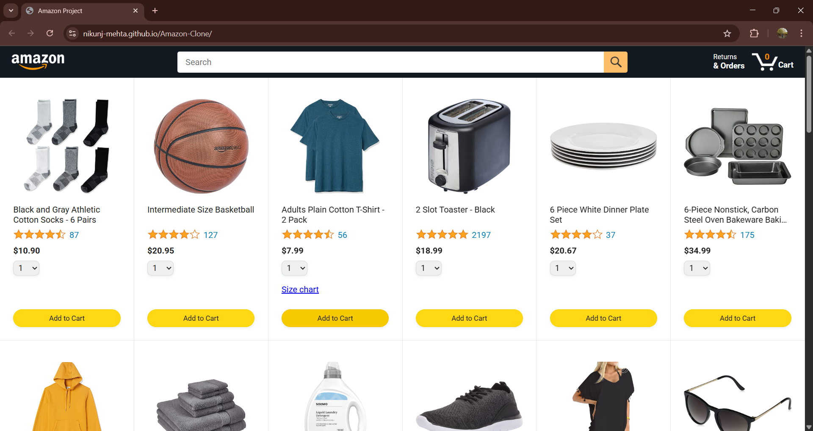
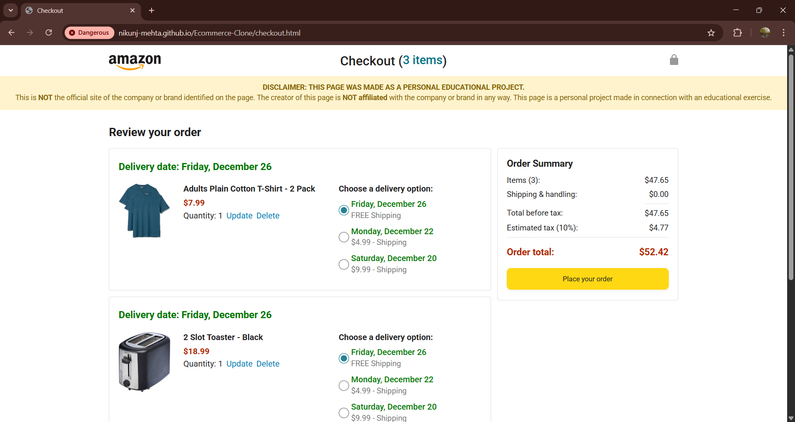
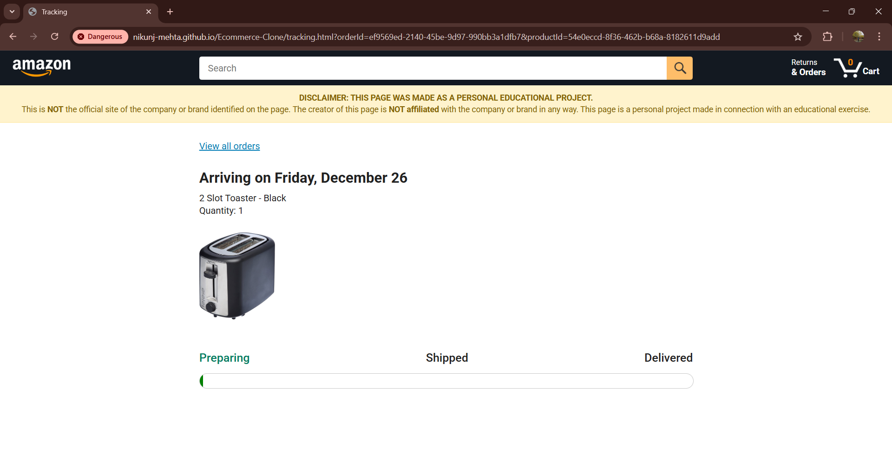

# 🛒 Amazon Clone  

A **front-end replica** of Amazon’s homepage, built using **HTML, CSS, and JavaScript**, to practice responsive web design and UI development.  

## 🔗 Live Demo  
🌐 **[View Project Here](https://nikunj-mehta.github.io/Amazon-Clone/)**  

## ✨ Features  
- 🧭 **Amazon-like Navigation Bar** – Fully functional header with logo, search, and account/cart sections.  
- 🛍️ **Product Listings & Banners** – Organized grid layout showcasing products and promotional banners.  
- 📱 **Responsive Design** – Optimized for desktops, tablets, and mobile devices.  
- 🎨 **Hover Effects & Animations** – Smooth transitions for interactive elements.  
- ⚡ **JavaScript Interactivity** – Basic DOM manipulation for dynamic effects.  

## 🛠 Tech Stack  
- **HTML5** – Structure of the application  
- **CSS3** – Styling & responsive design (Flexbox, Media Queries)  
- **JavaScript (ES6)** – Interactivity & DOM manipulation  
- **Font Awesome** – Icons  
- **Google Fonts** – Typography  

## 📂 Folder Structure
```
Amazon-Clone/
│── index.html # Main HTML file
│── style.css # Styling for layout & design
│── script.js # JavaScript logic for interactivity
│── /images # Image assets
```

## 📚 What I Learned  
- Crafting **pixel-perfect layouts** inspired by real-world websites  
- Implementing **responsive design principles** using Flexbox & media queries  
- Adding **hover effects** and smooth UI transitions  
- Deploying static websites using **GitHub Pages**  

## 🎯 Project Motivation  
This project was built to strengthen my **front-end development skills** by replicating a well-known, real-world website interface. The focus was on **responsiveness, clean UI design, and structured code** following industry practices.  

## 🚀 Future Improvements  
- Add product detail pages with dynamic rendering  
- Implement cart functionality with local storage  
- Integrate backend for real-time data fetching  

## 📸 Screenshots  

**Home Page**


**Cart Details**


**Tracking Page**


## 🧑‍💻 Author  
Developed by **[Nikunj Mehta](https://github.com/Nikunj-Mehta)** 🚀  

